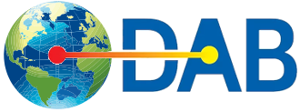

<!-- PROJECT LOGO -->
 

  

<h3 align="center">Discovery and Access Broker (DAB)</h3>

 
 
     
    <a href="#getting-started"><strong>Getting started»</strong></a>
     
     
    <a href="#license-and-attribution">License and attribution</a>
    <a href="#contact-essi-lab">Contact ESSI-Lab</a>    
  

 

Welcome to the GitHub repository of the DAB Community Edition (CE). This repository includes all consolidated and stable functionalities of the DAB. 

## About the DAB

The DAB is a **brokering software framework** for the **mediation and harmonization of geospatial data** with particular reference to Earth observation data, both satellite and non-satellite. DAB makes it possible to connect heterogeneous data sources and make them discoverable and accessible through homogeneous and standard interfaces by different data user tools and applications. The DAB is capable of implementing data discovery and access functionalities by implementing multiple standard interfaces (e.g. OGC, ISO,  ...), and Application Programming Interfaces (API).

(<a href="#top">back to top</a>)

## Getting started

  
Instructions on how to start using the DAB

 	
	
The DAB is composed by multiple maven modules. GS-service is the main module, capable of starting the DAB Internet services and its web configuration tool.

The command <code>mvn clean install</code> run in the root folder will compile the source code into jar files and finally compose the war package of DAB GS-service.

Finally, it's possible to launch DAB services on a single node configuration by launching the following maven command from the gs-service folder:

<code>mvn jetty:run -Ppreconfigured -DdbUser=XXX -DdbPassword=XXX -DquartzUser=root -DquartzPassword=XXX -DadminUser=XXX -DgoogleClientId=XXX -DgoogleClientSecret=XXX</code>

The DAB will launch using a preconfigured configuration where:
- dbUser/dbPassword are the credentials of a db installed on localhost (9200 port by default for OpenSearch db)
- quartzUser/quartzPassword are the credentials of a mysql db installed on localhost  (3306 port)
- adminUser/googleClientId/googleClientSecret are the Google OAuth credentials previously obtained through Google
- an OpenSearhc instance installed on localhost will receive statistics (9200 port)

The DAB can then be configured at the URL: 

http://localhost:9090/gs-service/conf
	
It's also possible to create a brand new configuration at the URL:

http://localhost:9090/gs-service/initialize

The web configurator tool enables to add/remove both profilers and accessors. In this configuration all the profilers are activated. For the accessors, it's needed to specify the data source URL endpoint, the accessor strategy (distributed vs harvested) and the connector type. It's also possible to start harvestings of specific sources.

A demo portal to check that DAB is working as expected will be available at the URL:
	
http://localhost:9090/gs-service/search

In a more complex configuration the DAB can be deployed on a cloud service, where multiple containers can be responsible for different tasks (e.g. frontend, harvesting, access). The DAB Dockerhub repository is currently under construction.

It's possible to create a docker image with the following commands from the gs-service project:

mvn -o -B -Pvaadin-production -Dmaven.test.skip=true clean package

mvn docker:build

This it will create the same DAB image that is also available on Docker Hub.

The docker container can readily be started for example with the following command:

docker run -p 8080:8080 -e "JAVA_OPTS=-Dconfiguration.url=file:///tmp" essilab/dab:latest
	

	

(<a href="#top">back to top</a>)

	
## License and attribution

While the DAB community edition code is **open source**, it is not a **public domain software**. Therefore, to use the DAB source code you should **give full attribution to the original authors** and **redistribute your modifications** in the same way, accordingly to the **GNU Affero General Public License v3.0** (see LICENSE). To know more about how to correctly utilize the DAB open source code and provide appropriate attribution, please, select the relevant cases:

	
To use the DAB technology for providing online services

 		
	
AGPL license is more restrictive with respect to GPL with regard to online service providers making use of the licensed software.

This is the case where a third party downloads the DAB source code and offers its functionalities through an online service (e.g. through a server managed by the third party). In this case **the following statement should appear at the third party site** offering the service:

<code>The brokering service is offered by DAB, a software developed by National Research Council of Italy (CNR)/Institute of Atmospheric Pollution Research (IIA)/ESSI-Lab. More information is available at https://github.com/ESSI-Lab/DAB/</code>

	

To use the DAB technology for a scientific and/or technological publication

 		
	
Please note at least **one of the following papers should be cited to give correct author attributions** while describing work making use of the DAB:

<code><a href="https://www.sciencedirect.com/science/article/pii/S1364815215000481">Stefano Nativi, Paolo Mazzetti, Mattia Santoro, Fabrizio Papeschi, Max Craglia, Osamu Ochiai, Big Data challenges in building the Global Earth Observation System of Systems, Environmental Modelling & Software, Volume 68, 2015,Pages 1-26, ISSN 1364-8152</a></code>

<code><a href="https://www.sciencedirect.com/science/article/abs/pii/S1364815215000481">Stefano Nativi, Paolo Mazzetti, Mattia Santoro, Fabrizio Papeschi, Max Craglia, Osamu Ochiai, Big Data challenges in building the Global Earth Observation System of Systems, Environmental Modelling & Software, Volume 68, 2015, Pages 1-26.</a></code>

<code><a href="https://www.igi-global.com/chapter/the-brokering-approach-for-enabling-collaborative-scientific-research/119828">Boldrini, Enrico,et al. "The Brokering Approach for Enabling Collaborative Scientific Research." Collaborative Knowledge in Scientific Research Networks, edited by Paolo Diviacco, et al., IGI Global, 2015, pp. 283-304.</a></code>
	
<code><a href="https://ieeexplore.ieee.org/abstract/document/6506981">S. Nativi, M. Craglia and J. Pearlman, "Earth Science Infrastructures Interoperability: The Brokering Approach," in IEEE Journal of Selected Topics in Applied Earth Observations and Remote Sensing, vol. 6, no. 3, pp. 1118-1129, June 2013, doi: 10.1109/JSTARS.2013.2243113.</a></code>	
	
<code><a href="https://ieeexplore.ieee.org/document/4782694">S. Nativi, L. Bigagli, P. Mazzetti, E. Boldrini and F. Papeschi, "GI-Cat: A Mediation Solution for Building a Clearinghouse Catalog Service," 2009 International Conference on Advanced Geographic Information Systems & Web Services, 2009, pp. 68-74, doi: 10.1109/GEOWS.2009.34.</a></code>
	
<code><a href="https://ieeexplore.ieee.org/abstract/document/5200393">S. Nativi and L. Bigagli, "Discovery, Mediation, and Access Services for Earth Observation Data," in IEEE Journal of Selected Topics in Applied Earth Observations and Remote Sensing, vol. 2, no. 4, pp. 233-240, Dec. 2009, doi: 10.1109/JSTARS.2009.2028584.</a></code>	

<code><a href="https://ieeexplore.ieee.org/document/4423731">S. Nativi, L. Bigagli, P. Mazzetti, U. Mattia and E. Boldrini, "Discovery, query and access services for imagery, gridded and coverage data a clearinghouse solution," 2007 IEEE International Geoscience and Remote Sensing Symposium, 2007, pp. 4021-4024, doi: 10.1109/IGARSS.2007.4423731.</a></code>
	

	
To start a new branch of the DAB software

 		
	
The modified source code should be licensed according to AGPL and **redistributed back to the community, preferably through the DAB GitHub repository**. You are welcome and encouraged to <a href="#contact-essi-lab">contact ESSI-Lab</a> to propose code contributions to be applied to the present repository (see contributions section).

In any case the following attribution headers should be preserved in modified versions of the source code:

<code>Discovery and Access Broker (DAB) Community Edition (CE)</code>

<code>Copyright (C) 2021 National Research Council of Italy (CNR)/Institute of Atmospheric Pollution Research (IIA)/ESSI-Lab</code>

In case a modified version of the DAB is offered by a third party as an Internet service, additionally to the attribution described above also the code (or a link to the DAB GitHub repository holding the modifications) should be made available on the third party site.

	
	

(<a href="#top">back to top</a>)

## Contributions

	
How to contribute to this project

 		
	
Contributors to the ESSI-Lab DAB CE project are welcome: you can **report bugs and request enhancements** <a href="#contact-essi-lab">contacting ESSI-Lab</a> or through the GitHub issue tracker.

To **propose code contributions** please <a href="#contact-essi-lab">contact ESSI-Lab</a> to coordinate the development effort and avoid duplications.

The <a href="https://gist.github.com/ESSI-Lab/68833fd7d9896513ae95a575695a85a2">ESSI-Lab Contributor License Agreement</a> (based on HA-CLA-I-OSI) needs to be signed by contributors to enable ESSI-Lab to accept community contributions to the DAB repository even more smoothly. Now the signature of the agreement is fully integrated in the Github pull request.

If you're interested in contributing, please take a look as well at <a href="https://raw.githubusercontent.com/ESSI-Lab/DAB/main/CODE_OF_CONDUCT.md">ESSI-Lab's Contributor Code of Conduct</a>.	
	

	

(<a href="#top">back to top</a>)

## DAB history and acknowledgments

	
Learn more about the DAB history and the main contributors

 	
	
DAB was first conceived and is still maintained and advanced by the [ESSI-Lab](https://essi-lab.eu) based at the [Florence division](https://iia.cnr.it/sede-firenze/) of the [Institute of Atmospheric Pollution Research (IIA)](https://iia.cnr.it/) of [National Research Council of Italy (CNR)](https://www.cnr.it/).

DAB implements the **data brokering approach** as introduced by Stefano Nativi et al. in the position paper: <code><a href="https://ieeexplore.ieee.org/abstract/document/6506981">S. Nativi, M. Craglia and J. Pearlman, "Earth Science Infrastructures Interoperability: The Brokering Approach," in IEEE Journal of Selected Topics in Applied Earth Observations and Remote Sensing, vol. 6, no. 3, pp. 1118-1129, June 2013, doi: 10.1109/JSTARS.2013.2243113.</a></code> by applying the mediation pattern <code><a href="https://ieeexplore.ieee.org/abstract/document/5200393">S. Nativi and L. Bigagli, "Discovery, Mediation, and Access Services for Earth Observation Data," in IEEE Journal of Selected Topics in Applied Earth Observations and Remote Sensing, vol. 2, no. 4, pp. 233-240, Dec. 2009, doi: 10.1109/JSTARS.2009.2028584.</a></code>

### Projects	
	
The DAB software has been developed in the context of numerous National, European, and international projects and initiatives, which have been funded and/or operated by different organizations, over the last ten years, including:

<ul>
 <li>Intergovernmental initiatives
 <ul>
  <li>GEO
  <ul>
   <li><b>GEOSS Global Earth System of Systems</b></li>
  </ul>
  </li>
  <li>WMO
  <ul>
   <li><b>"WHOS-Plata"</b> (2019/2020)</li>
   <li><b>"WHOS-Dominican Republic"</b> (2020/2022)</li>
   <li><b>"WHOS"</b> (2021/2024)</li>
  </ul>
  </li>
  </ul>
 </li>
 <li>European Union funded projects
 <ul>
  <li>Horizon Europe
  <ul>
   <li><b>FAIR-EASE</b> (2022/2025)</li>
   <li><b>Blue-Cloud 2026</b> (2023/2026)</li>
   <li><b>TRIGGER</b> (2022/2027)</li>
  </ul>
  </li>	 
	<li>Horizon 2020
      <ul>
      <li><b>ODIP 2</b> (2015/2018)</li>
      <li><b>ERA-PLANET</b> (2016/2022)</li>
      <li><b>SeaDataCloud</b> (2016/2021)</li>
      <li><b>Blue-Cloud</b> (2019/2023)</li>
      <li><b>I-CHANGE</b> (2021/2025)</li>
      </ul>
	</li>
	<li>EASME
	<ul>
      <li><b>EMODNet Ingestion</b> (2016/2019)</li>
      <li><b>EMODNet Ingestion II</b> (2019/2021)</li>
      <li><b>EMODNet Ingestion III</b> (2022/2024)</li>
      </ul>
    </li>
  <li>FP7
  <ul>
   <li><b>EuroGEOSS</b> (2009/2012)</li>
   <li><b>SeaDataNet II</b> (2011/2015)</li>
   <li><b>GEOWOW</b> (2011/2014)</li>
   <li><b>ODIP</b> (2011/2015)</li>
  </ul>
  </li>
	<li>European Space Agency (ESA)
      <ul>
      <li><b>HMA-T</b> (2008/2009)</li>
      <li><b>Prod-Trees</b> (2012/2015)</li>
      <li><b>DAB4EDGE</b> (2018/2020)</li>
      <li><b>DAB4GPP</b> (2022/2025)</li>
      </ul>
      </li>
      </ul>
</li>
	<li>National agencies
	<ul>
	<li>National Science Foundation (USA)
     <ul><li><b>BCube</b> (2013/2016)</li></ul>
     </li>
    <li>MIUR (Italy)
    <ul><li><b>ND-SoS-Ina</b> (2012/2015)</li></ul>
    </li>
	<li>ARPA-ER (Italy)
		<ul>
	<li><b>P107009S</b> (2016)</li>
	<li><b>PGSIM/2017/771</b> (2017)</li>
	<li><b>PGSIM/2018/0000563</b> (2018)</li>
	<li><b>LoA Arpae SIMC/CNR-IIA</b> (2019)</li>
	</ul>
	</li>
	<li>ISPRA (Italy)
	<ul><li><b>HIS-Central</b> (2021-2025)</li></ul>
</li>
</ul>
</li>
</ul>
	
### Main running deployments
		
As from 2012, the DAB technology has been utilized by [GEO](https://earthobservations.org/) (the Group of Earth Observation) as the enabling component of the **GEO-DAB**: the brokerage data services middleware of the [GEOSS](https://earthobservations.org/geoss.php) (Global Earth Observation System of Systems) platform (formerly known as GCI). GEO-DAB is deployed and operated on a scalable cloud infrastructure. In 2021, the GEO-DAB has connected over 190 different geospatial information systems, which allow the search and discovery of more than 10 million datasets, consisting of over 1 billion single downloadable data files (i.e. data granules in GEO jargon). A useful reference is: <code><a href="https://www.sciencedirect.com/science/article/abs/pii/S1364815215000481">Stefano Nativi, Paolo Mazzetti, Mattia Santoro, Fabrizio Papeschi, Max Craglia, Osamu Ochiai, Big Data challenges in building the Global Earth Observation System of Systems, Environmental Modelling & Software, Volume 68, 2015, Pages 1-26.</a></code>. More info on GEO-DAB is available [here](https://www.geodab.net/)

As of 2017, the DAB software has been also adopted by [WMO](https://public.wmo.int/en) as one of the enabling technologies of the **WMO Hydrological Observing System (WHOS)**: a system of systems capable to share hydrological data, at a global scale. More info on WHOS [here](https://public.wmo.int/en/our-mandate/water/whos). A WHOS webinar was recently hold to introduce users to the WHOS brokering services; the webinar recording is available [here](https://community.wmo.int/news/watch-recording-whos-webinar).

In 2011, the [SeaDataNet](https://www.seadatanet.org/) data platform started utilizing the DAB technology to enable the discovery and access of different international ocean data sources.  More information on SeaDataNet brokering services is availabe [here](https://www.seadatanet.org/Data-Access/Discover-international-data). The DAB mediation and brokering services were also applied by the [ODIP](http://www.odip.org/) community to interconnect the ocean information system-of-systems from USA, Australia, and Europe.
	
### Awards

The DAB technology won the **2014 Geospatial World Innovation Awards** [(media coverage here)](https://www.cnr.it/en/news/5795/il-geospatial-world-innovation-award-all-iia-cnr).
	
### Useful References

The following papers provide a technical description of the DAB brokering framweork.

<code><a href="https://www.doi.org/10.1080/17538947.2022.2099591">Enrico Boldrini, Stefano Nativi, Silvano Pecora, Igor Chernov & Paolo Mazzetti (2022) Multi-scale hydrological system-of-systems realized through WHOS: the brokering framework, International Journal of Digital Earth, 15:1, 1259-1289, DOI: 10.1080/17538947.2022.2099591<a/></code>

<code><a href="https://www.igi-global.com/chapter/the-brokering-approach-for-enabling-collaborative-scientific-research/119828">Boldrini, Enrico,et al. "The Brokering Approach for Enabling Collaborative Scientific Research." Collaborative Knowledge in Scientific Research Networks, edited by Paolo Diviacco, et al., IGI Global, 2015, pp. 283-304.</a></code>

<code><a href="https://www.sciencedirect.com/science/article/abs/pii/S1364815215000481">Stefano Nativi, Paolo Mazzetti, Mattia Santoro, Fabrizio Papeschi, Max Craglia, Osamu Ochiai, Big Data challenges in building the Global Earth Observation System of Systems, Environmental Modelling & Software, Volume 68, 2015, Pages 1-26.</a></code>
	
<code><a href="https://ieeexplore.ieee.org/abstract/document/6506981">S. Nativi, M. Craglia and J. Pearlman, "Earth Science Infrastructures Interoperability: The Brokering Approach," in IEEE Journal of Selected Topics in Applied Earth Observations and Remote Sensing, vol. 6, no. 3, pp. 1118-1129, June 2013, doi: 10.1109/JSTARS.2013.2243113.</a></code>	
	
<code><a href="https://ieeexplore.ieee.org/document/4782694">S. Nativi, L. Bigagli, P. Mazzetti, E. Boldrini and F. Papeschi, "GI-Cat: A Mediation Solution for Building a Clearinghouse Catalog Service," 2009 International Conference on Advanced Geographic Information Systems & Web Services, 2009, pp. 68-74, doi: 10.1109/GEOWS.2009.34.</a></code>
	
<code><a href="https://ieeexplore.ieee.org/abstract/document/5200393">S. Nativi and L. Bigagli, "Discovery, Mediation, and Access Services for Earth Observation Data," in IEEE Journal of Selected Topics in Applied Earth Observations and Remote Sensing, vol. 2, no. 4, pp. 233-240, Dec. 2009, doi: 10.1109/JSTARS.2009.2028584.</a></code>	

<code><a href="https://ieeexplore.ieee.org/document/4423731">S. Nativi, L. Bigagli, P. Mazzetti, U. Mattia and E. Boldrini, "Discovery, query and access services for imagery, gridded and coverage data a clearinghouse solution," 2007 IEEE International Geoscience and Remote Sensing Symposium, 2007, pp. 4021-4024, doi: 10.1109/IGARSS.2007.4423731.</a></code>
	
	

### Contributors
	
Many data scientists, computer scientists, information and software engineers have contributed to the DAB design and development throughout an implementation effort of over ten years, spanning different maturity stages (from prototypical to operational)  and sub-components (e.g. GI-cat, GI-axe, GI-sem, GI-suite, ...).

DAB development team, in alphabetic order [(contact us)](https://www.uos-firenze.essi-lab.eu/personnel):

- Lorenzo Bigagli (software design)
- Enrico Boldrini (software design, developer, coordinator of DAB activities with WMO)
- Paolo Mazzetti (responsible)
- Stefano Nativi (DAB father)
- Massimiliano Olivieri (sysadmin)
- Fabrizio Papeschi (developer)
- Roberto Roncella (developer)
- Mattia Santoro (software design, developer, coordinator of DAB activities with GEO)
	
Experts who contributed with valuable inputs and feedbacks representing significant data provider and user communities (in alphabetic order):
	
- Alessandro Annoni
- Igor Chernov
- Guido Colangeli
- Max Craglia
- Paola De Salvo
- Ben Domenico
- Gregory Giuliani
- Wim Hugo
- Siri Jodha Khalsa
- Osamu Ochiai
- Washington Otieno
- Anthony Lehmann
- Joan Masó
- Francoise Pearlman
- Jay Pearlman
- Silvano Pecora
- Nicola Pirrone
- Antonello Provenzale
- Barbara Ryan
- Dick Schaap
- Richard Signell
- Joost Van Bemmelen

Previous members of the development team:
	
- Francesco Pezzati (past developer)
- Alessio Baldini (past developer)
- Fabrizio Vitale (past developer)
- Ugo Mattia (past developer)
- Valerio Angelini (past developer)
	
### Credits
	
ESSI-Lab would like to credit all the maintainers and developers of the third party services and technologies that DAB uses. They include:
	
- OpenSearch
- MySQL
- ElasticSearch
- Amazon AWS
- Google Cloud Platform
- Google OAuth
- Facebook OAuth
- Twitter OAuth	
- Docker
- Kubernetes
	
See the `THIRD-PARTY` file for third-party license notices.

 Icons appearing on this page are made by <a href="https://www.freepik.com" title="Freepik"> Freepik </a> from <a href="https://www.flaticon.com/" title="Flaticon">www.flaticon.com</a>

 

Altough we have made our best effort to give the appropriate credits, some entries might be missing or incorrect: you are welcome to report to ESSI-Lab any of such issues you might identifiy.
	

	
	

(<a href="#top">back to top</a>)

## Contact ESSI-Lab

You are welcome to contact us for any info about the DAB, including bug reports, feature enhancements and code contributions.

[http://essi-lab.eu/](http://essi-lab.eu/)

[info@essi-lab.eu](info@essi-lab.eu)

GitHub repository link: [https://github.com/ESSI-Lab/DAB](https://github.com/ESSI-Lab/DAB)

(<a href="#top">back to top</a>)

